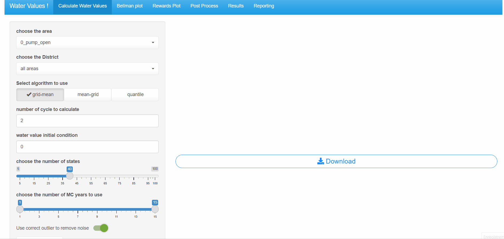

```{r, include = FALSE}
knitr::opts_chunk$set(
  collapse = TRUE,
  comment = "#>",
  fig.path = "man/figures/README-",
  out.width = "100%"
)
```

# {width="250"}

# antaresWaterValues

The R package watervalues allows to :

1\. Prepare the Antares study by creating the fictive area,

2\. Launch the simulations by updating the coupling constraints,

3\. Read the results

4\. Calculate the water values

## Installation

You can install the package from [GitHub](https://github.com/) with:

``` r
# install.packages("devtools")
devtools::install_github("rte-antares-rpackage/antaresWaterValues", build_vignettes = TRUE)
```

To install all the package dependencies you can run the script `inst/dependencies.R`

## Using the Shiny app

```{r}
library(antaresWaterValues)
```

Now we are ready to use our package.

```{r eval=FALSE}
shiny_water_values()
```



## Without the Shiny app

Begin by defining some parameters about your study.

```{r eval=FALSE}
study_path <- "your/path/to/the/antares/study"
area <- "name_of_area"
pumping <- T #T if pumping possible
mcyears <- 1:10 # Monte Carlo years you want to use

opts <- antaresRead::setSimulationPath(study_path,"input")
pump_eff <- getPumpEfficiency(area,opts=opts)
```

Then, you have to run simulations.

```{r eval=FALSE}
simulation_res <- runWaterValuesSimulation(
    area=area,
    nb_disc_stock = 5, #number of simulations
    nb_mcyears = mcyears,
    path_solver = "your/path/to/antares/bin/antares-8.1-solver.exe",
    fictive_area = paste0("watervalue_",area),
    thermal_cluster = "watervaluecluster",
    overwrite = TRUE,
    link_from=area,
    opts = opts,
    otp_dest=paste0(study_path,"/user"),
    file_name=paste0(j,"_",area), #name of the saving file
    pumping=pumping,
    efficiency=pump_eff,
    launch_simulations=T,
    reset_hydro=T
  )
```

It's now possible to calculate water values.

```{r eval=FALSE}
results <- Grid_Matrix(
  area=area,
  simulation_names=simulation_res$simulation_names,
  simulation_values=simulation_res$simulation_values,
  nb_cycle = 2L,
  mcyears = mcyears,
  week_53 = 0,#initial Bellman values
  states_step_ratio = 1/20, # discretization of states
  method= c("mean-grid","grid-mean","quantile")[1],
  q_ratio=0.5,# for quantile method
  opts = opts,
  pumping=pumping,
  efficiency=pump_eff,
  correct_concavity = FALSE,#correct concavity of Bellman values
  correct_monotony_gain = FALSE,#correct monotony of rewards
  penalty_low = 3,#penalty for bottom rule curve
  penalty_high = 0,#penalty for top rule curve
  method_old_gain = T,# T if you want a simple linear interpolation of rewards,
                      # F if you want to use marginal price to interpolate
  hours_reward_calculation = c(seq.int(0,168,10),168),# used for marginal prices interpolation
  controls_reward_calculation = constraint_generator(area=area,
                                                     nb_disc_stock = 20,
                                                     pumping = pumping,
                                                     pumping_efficiency = pump_eff,
                                                     opts=opts)# used for marginal prices interpolation
)
aggregated_results <- results$aggregated_results
```

You can plot the results

```{r, include=FALSE}
aggregated_results <- example_aggregated_results
reward <- example_reward
```

```{r watervalues}
waterValuesViz(Data=aggregated_results,filter_penalties = F)
```
```{r bellman}
plot_Bellman(value_nodes_dt = aggregated_results, 
             week_number = c(1,3),
             penalty_high = 0,
             penalty_low = 3)
```
You can also plot reward functions

```{r eval=FALSE}
reward <- get_Reward(
  simulation_names = simulation_res$simulation_names,
  simulation_values = simulation_res$simulation_values,
  opts=opts,
  area = area,
  mcyears = mcyears,
  pump_eff = pump_eff,
  method_old = T,# T if you want a simple linear interpolation of rewards,
                 # F if you want to use marginal price to interpolate
  hours = c(seq.int(0,168,10),168),# used for marginal prices interpolation
  possible_controls = constraint_generator(area=area,
                                           nb_disc_stock = 20,
                                           pumping = pumping,
                                           pumping_efficiency = pump_eff,
                                           opts=opts)# used for marginal prices interpolation
)
reward <- reward$reward
```

```{r reward}
plot_1 <- plot_reward(reward_base = reward,
                      week_id = c(1,3))
plot_2 <- plot_reward_mc(reward_base = reward,
                         week_id = c(1,3),
                         Mc_year = c(1,2))
plot_3 <- plot_reward_variation(reward_base = reward,
                                week_id = c(1,3))
plot_4 <- plot_reward_variation_mc(reward_base = reward,
                                   week_id = c(1,3),
                                   Mc_year = c(1,2))
```

