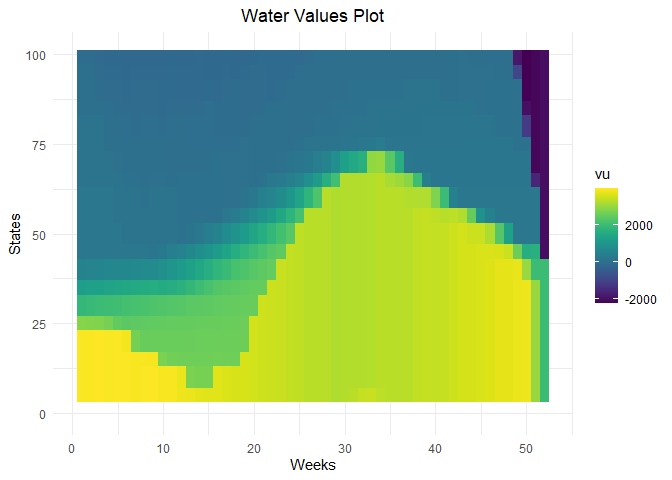

<!-- README.md is generated from README.Rmd. Please edit that file -->


# antaresWaterValues

<!-- badges: start -->
<!-- badges: end -->

This package calculate water values for long term storages in Antares
studies. It uses Antares simulations and dynamic programming.

More theoretical details are given in :
`vignette("computation_watervalues")`.

## Installation

You can install the latest version of antaresWaterValues from GitHub
with:

``` r
# install.packages("devtools")
devtools::install_github("rte-antares-rpackage/antaresWaterValues@*release") 
```

To load the package use :

``` r
library(antaresWaterValues)
```

Now we are ready to use our package. If something gets wrong, please
check dependencies versions in `DESCRIPTION`.

The package edits the Antares study and resets it at the end but it
could be wise to make a copy of the study before using the package for
the first time.

## Using the Shiny app

``` r
opts = antaresRead::setSimulationPath("your/path/to/the/antares/study","input") 
shiny_water_values(opts)
```

## Without the Shiny app

Begin by defining some parameters about your study.

``` r
opts <- antaresRead::setSimulationPath("your/path/to/the/antares/study","input")
```

``` r
area <- "area"
pumping <- T #T if pumping possible
mcyears <- 1:3 # Monte Carlo years you want to use
efficiency <- getPumpEfficiency(area,opts=opts)
name = "3sim"
```

Then, you have to run simulations.

``` r
simulation_res <- runWaterValuesSimulation(
    area=area,
    nb_disc_stock = 3, #number of simulations
    mcyears = mcyears,
    path_solver = "your/path/to/antares/bin/antares-8.6-solver.exe",
    opts = opts,
    otp_dest=paste0(opts$studyPath,"/user"),
    file_name=name, #name of the saving file
    pumping=pumping,
    efficiency=efficiency
  )
```

If you want to retrieve results from previous simulations, you can use :

``` r
load(paste0(opts$studyPath, "/user/", tolower(area),"_",name, ".RData"))
```

Now compute reward functions :

``` r
reward_db <- get_Reward(
  simulation_names = simulation_res$simulation_names,
  simulation_values = simulation_res$simulation_values,
  opts=opts,
  area = area,
  mcyears = mcyears,
  efficiency = efficiency,
  method_old = T,# T if you want a simple linear interpolation of rewards,
                 # F if you want to use marginal price to interpolate
  possible_controls = constraint_generator(area=area,
                                           nb_disc_stock = 20,
                                           mcyears=mcyears,
                                           pumping = pumping,
                                           efficiency = efficiency,
                                           opts=opts)# used for marginal prices interpolation
)
reward <- reward_db$reward
```

Finally, compute water values :

``` r
results <- Grid_Matrix(
  area=area,
  reward_db = reward_db,
  mcyears = mcyears,
  states_step_ratio = 1/20, # discretization of states
  opts = opts,
  efficiency=efficiency,
  penalty_low = 1000,#penalty for bottom rule curve
  penalty_high = 100,#penalty for top rule curve
  force_final_level = T, # T if you want to constrain final level with penalties (see Grid_Matrix documentation for more information)
  final_level = get_initial_level(area=area,opts=opts), # wanted final level (between 0 and 100%)
  penalty_final_level_low = 2000,
  penalty_final_level_high = 2000
)
```



``` r
aggregated_results <- results$aggregated_results
```

Water values are written to Antares thanks to the following instructions
:

``` r
reshaped_values <- aggregated_results %>%
  to_Antares_Format_bis()
antaresEditObject::writeWaterValues(
  area = area,
  data = reshaped_values
)
```

Values in `reshaped_values` are not monotone because Antares will
average values.

Before running a simulation, `hydro-princing-mode` must be change to
`accurate` :

``` r
settings_ini <- antaresRead::readIni(file.path("settings", "generaldata.ini"),opts=opts)
settings_ini$`other preferences`$`hydro-pricing-mode` = "accurate"
antaresEditObject::writeIni(settings_ini, file.path("settings", "generaldata.ini"),overwrite=T,opts=opts)
```

### Plot results

``` r
waterValuesViz(Data=aggregated_results,filter_penalties = T)
```


``` r
plot_Bellman(value_nodes_dt = aggregated_results, 
             weeks_to_plot = c(1,3))
```


You can also plot reward functions

``` r
plot_1 <- plot_reward(reward_base = reward,
                      weeks_to_plot = c(1,3))
```


``` r
plot_2 <- plot_reward_mc(reward_base = reward,
                         weeks_to_plot = c(1,3),
                         scenarios_to_plot = c(1,2))
```


``` r
plot_3 <- plot_reward_variation(reward_base = reward,
                                weeks_to_plot = c(1,3))
```


``` r
plot_4 <- plot_reward_variation_mc(reward_base = reward,
                                   weeks_to_plot = c(1,3),
                                   scenarios_to_plot = c(1,2))
```


