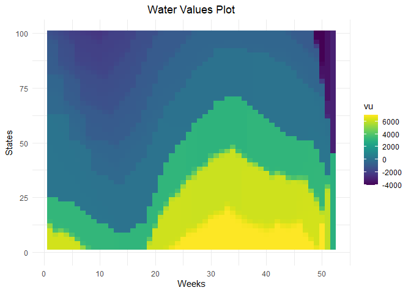
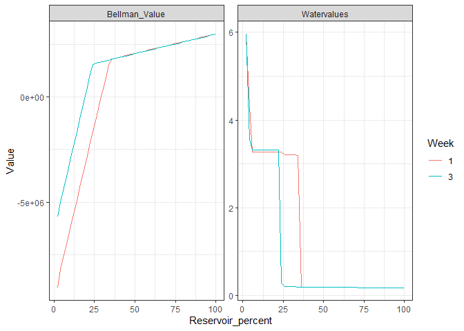
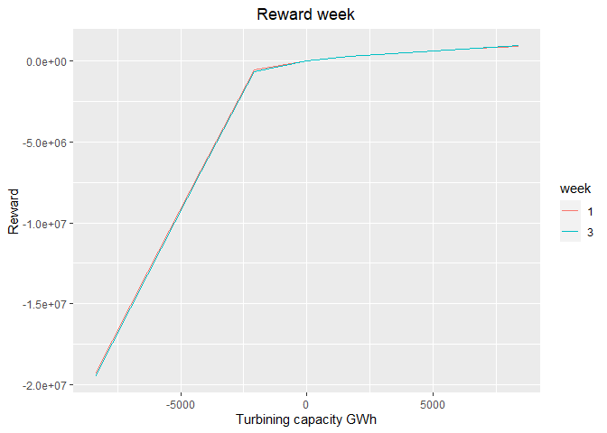
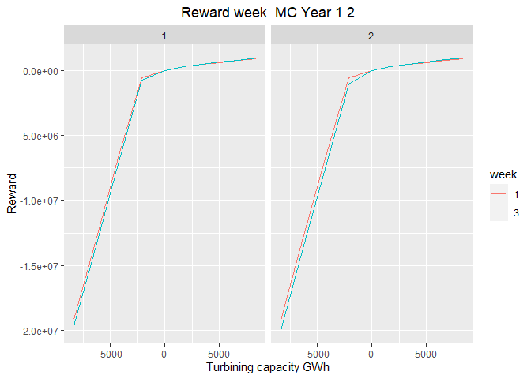
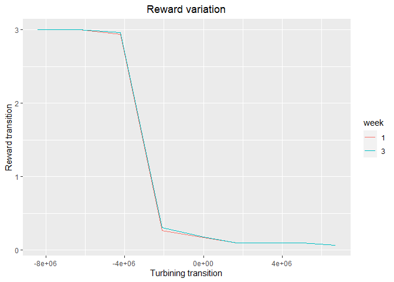
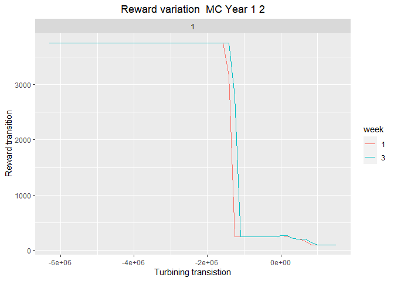
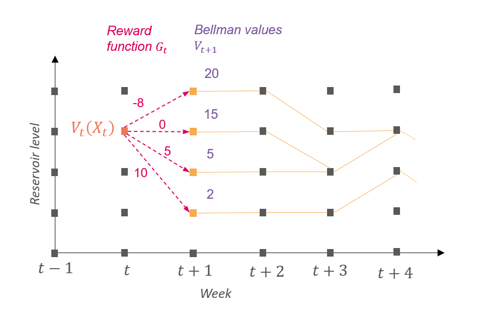

# 

# antaresWaterValues

The R package watervalues allows to calculate water values for a given
reservoir using Antares simulations and dynamic programming.

More theoretical details are given at the end.

## Installation

You can install the package from [GitHub](https://github.com/) with:

``` r
# install.packages("devtools")
devtools::install_github("rte-antares-rpackage/antaresWaterValues", build_vignettes = TRUE)
```

To install all the package dependencies you can run the script
`inst/dependencies.R`

## Using the Shiny app

``` r
library(antaresWaterValues)
#> Le chargement a nécessité le package : data.table
```

Now we are ready to use our package.

``` r
opts = antaresRead::setSimulationPath("your/path/to/the/antares/study","input") 
shiny_water_values(opts)
```


## Without the Shiny app

Begin by defining some parameters about your study.

``` r
study_path <- "your/path/to/the/antares/study"
area <- "name_of_area"
pumping <- T #T if pumping possible
mcyears <- 1:10 # Monte Carlo years you want to use

opts <- antaresRead::setSimulationPath(study_path,"input")
pump_eff <- getPumpEfficiency(area,opts=opts)
```

Then, you have to run simulations.

``` r
simulation_res <- runWaterValuesSimulation(
    area=area,
    nb_disc_stock = 5, #number of simulations
    mcyears = mcyears,
    path_solver = "your/path/to/antares/bin/antares-8.6-solver.exe",
    overwrite = TRUE,
    opts = opts,
    file_name=paste0("watervalue_",area), #name of the saving file
    pumping=pumping,
    efficiency=pump_eff,
    launch_simulations=T,
    expansion = T # use mode expansion of Antares to have smoother results faster
  )
```

It’s now possible to calculate water values.

``` r
results <- Grid_Matrix(
  area=area,
  simulation_names=simulation_res$simulation_names,
  simulation_values=simulation_res$simulation_values,
  nb_cycle = 2L,
  mcyears = mcyears,
  week_53 = 0,#initial Bellman values
  states_step_ratio = 1/20, # discretization of states
  method= c("mean-grid","grid-mean","quantile")[1],
  q_ratio=0.5,# for quantile method
  opts = opts,
  pumping=pumping,
  efficiency=pump_eff,
  correct_concavity = FALSE,#correct concavity of Bellman values
  correct_monotony_gain = FALSE,#correct monotony of rewards
  penalty_low = 300,#penalty for bottom rule curve
  penalty_high = 0,#penalty for top rule curve
  method_old_gain = T,# T if you want a simple linear interpolation of rewards,
                      # F if you want to use marginal price to interpolate
  hours_reward_calculation = c(seq.int(0,168,10),168),# used for marginal prices interpolation
  controls_reward_calculation = constraint_generator(area=area,
                                                     nb_disc_stock = 20,
                                                     pumping = pumping,
                                                     pumping_efficiency = pump_eff,
                                                     opts=opts,
                                                     mcyears=mcyears),# used for marginal prices interpolation
  force_final_level = T, # T if you want to constrain final level with penalties (see Grid_Matrix documentation for more information)
  final_level = 50, # in percent
  penalty_final_level_low = 1000,
  penalty_final_level_high = 1000,
  expansion = simulation_res$expansion,
)
aggregated_results <- results$aggregated_results
```

Water values are written to Antares thanks to the following instructions

``` r
reshaped_values <- aggregated_results %>%
  to_Antares_Format_bis()
antaresEditObject::writeWaterValues(
  area = area,
  data = reshaped_values
)
```

You can plot the results

``` r
waterValuesViz(Data=aggregated_results,filter_penalties = F)
```



``` r
plot_Bellman(value_nodes_dt = aggregated_results, 
             week_number = c(1,3))
```



You can also plot reward functions

``` r
reward <- get_Reward(
  simulation_names = simulation_res$simulation_names,
  simulation_values = simulation_res$simulation_values,
  opts=opts,
  area = area,
  mcyears = mcyears,
  pump_eff = pump_eff,
  method_old = T,# T if you want a simple linear interpolation of rewards,
                 # F if you want to use marginal price to interpolate
  possible_controls = constraint_generator(area=area,
                                           nb_disc_stock = 20,
                                           pumping = pumping,
                                           pumping_efficiency = pump_eff,
                                           opts=opts,
                                           mcyears = mcyears),# used for marginal prices interpolation
  expansion = simulation_res$expansion,
  max_hydro = get_max_hydro(area,timeStep = "hourly")
)
reward <- reward$reward
```

``` r
plot_1 <- plot_reward(reward_base = reward,
                      week_id = c(1,3))
```



``` r
plot_2 <- plot_reward_mc(reward_base = reward,
                         week_id = c(1,3),
                         Mc_year = c(1,2))
```



``` r
plot_3 <- plot_reward_variation(reward_base = reward,
                                week_id = c(1,3))
```



``` r
plot_4 <- plot_reward_variation_mc(reward_base = reward,
                                   week_id = c(1,3),
                                   Mc_year = c(1,2))
```



## How does it work ?

To understand how the package works, the user needs to understand what
are water values and how to calculate them in theory. After that, they
will able to understand the method used to calculate water values with
Antares.

### Theory

#### Why do we need water values ?

Antares solves week by week the annual unit commitment problem. When
long term water reservoirs are used in Antares, a procedure is needed to
determine which amount of water Antares should use for a given week and
which amount Antares should keep for the rest of the year. One method to
do so is to use water values.

#### What are water values ?

Water values are prices in euros per MWh that helps Antares, in his
weekly sequentially resolution, to determine whether to use the water
stocked in reservoirs during the current week or to keep it for later in
the year. There is one value per reservoir per week and per reservoir
level. Water values are comparable to marginal prices of thermal units.
A simple criterion to understand water values is the following :

- During an hour, if the marginal price is greater than the water value,
  it’s better to turbine the water in the reservoir.

- Otherwise, if the marginal price is lower than the water value
  multiplied by the pumping efficiency, it’s better to pump water into
  the reservoir, if pumping is possible.

These water values are defined by the user so they needs a method to
calculate them.

#### How to calculate water values ?

Water values are the derivatives of Bellman values. Bellman values are
given, alike water values, for each reservoir, each week and each
reservoir level. They represent the future gains in euros that are
possible to make with the amount of water stocked in the reservoir. They
are supposed to be concave for a given week. In consequence, water
values are supposed to be decreasing for a given week, which you can see
on the images above, and this is, in fact, one strong assumption of
Antares.

#### How to calculate Bellman values ?

To calculate Bellman values, one needs to solve the following
optimization problem by dynamic programming. This means that one begins
by solving the problem by the last week of the year and then one solves
the precedent week through backtracking.

$$
V_t(X_t) = \max_{U \in [U^{min},U^{max}],X_{t+1}=X_t-U_t+I_t,X_{t+1} \in [X_{t+1}^{min},X_{t+1}^{max}]} G_t(X_t,U_t,W_t) + V_{t+1}(X_{t+1})
$$

We use the following notations :

- $t \in [1,T]$ representing the weeks of the year.

- $V_t(X_t)$ is the Bellman value for week $t$ and for the reservoir
  level at the beginning of week $t$ $X_t$.

- $V_{T+1}(X_{T+1}) = K(X_{T+1})$ is the Bellman value at the end of the
  year that is supposed to be known.

- $U_t$ is the amount of water destocked ($>0$) or pumped ($<0$) with
  extreme values $U^{min}$ and $U^{max}$. It is also called the control.

- $I_t$ is the inflow during week $t$.

- $[X_t^{min},X_t^{max}]$ are the rule curves for the beginning of week
  $t$.

- $G_t(X_t,U_t,W_t)$ is the reward during week $t$ depending on the
  hazards $W_t$ that comprise the inflow. Hazards are represented by
  Monte Carlo years in Antares.

This equation means that the gain that is possible to make between the
beginning of week $t$ and the end of the year is the best compromise
between the gain at week $t$ and the gain between the beginning of week
$t+1$ and the end of the year. In other words, it is the best compromise
between using water during week $t$ and keeping it for the other weeks.



### Practice

There are three main steps to calculate water values in this package
using Antares :

1.  Calculate rewards functions $G_t(X_t,U_t,W_t)$ for all weeks and all
    possible hazards.

2.  Apply the precedent equation to calculate Bellman values.

3.  Calculate the derivative of Bellman values to get water values.

Each step is detailed is the following paragraphs.

#### Rewards functions

First of all, we assume that the reward $G_t(X_t,U_t,W_t)$ doesn’t
depend on the reservoir level $X_t$.

In the simulation tab, the user chooses a set of controls for which the
reward function will be evaluated. There is the same number of controls
for each week but the value of the controls can change if the maximum
power of the turbine varies between weeks. For each control, a complete
Antares simulation is launched, IE for all weeks and all Monte Carlo
years. This means there is exactly one simulation per control. To force
the control of the reservoir during a given simulation, the reservoir is
deactivated, fictive areas are created and a biding constraint is added.

One all simulations are run, in the “calculate water values” tab, the
user can choose to estimate the reward function for more controls than
the ones used in simulation. Indeed, the user can choose to use marginal
prices to interpolate reward functions. The idea behind this method is
to use hourly marginal prices of each simulation to estimate the reward
one could make by slightly changing the control for which the simulation
was run. The user has to choose a number of hours that corresponds to
the level of discretization of the hourly marginal prices kept to
interpolate and a number of controls for which the estimation of the
reward function will be calculated. This method is a little time
consuming but if it is used, less Antares simulations are needed and the
reward functions will necessary be concave. In case the user doesn’t
choose this method, they can choose to correct the monotony of the
reward functions which is an expected feature. Then, in both cases,
whether marginal prices are been used to interpolate or not, during the
dynamic programming phase, if the algorithm needs a reward for a control
that hasn’t been evaluated, it uses linear interpolation between
controls.

#### Calculation of Bellman values

Using reward functions, one can now calculate Bellman values. The
package uses discretization of reservoir levels (number of states) to do
so. The user has to define the initial value of Bellman values for week
53. To eliminate the edge effect of this initial value, we recommend to
caculate 2 cycles of Bellman values. The user can also choose to iterate
the calculation of Bellman values until convergence. The user also
choose the way they want to handle The different Bellman values for the
different Monte Carlo years. They can choose to mean them at the end of
each week calculation (recommended, grid-mean) or at the end of the
algorithm (mean-grid). The user has to define penalty for not respecting
rule curves. It is possible to correct concavity of Bellman values to
ensure that water values will be decreasing. This isn’t necessary if
marginal prices have been used to interpolate reward functions.

#### Calculation of water values

This last step is very simple. The package interpolates Bellman values
to have a step of discretization of 1% and then calculates the
derivative of Bellman values to have one value per reservoir level and
per day (water values are constant for a given week).
