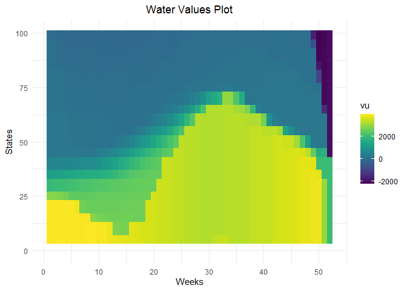
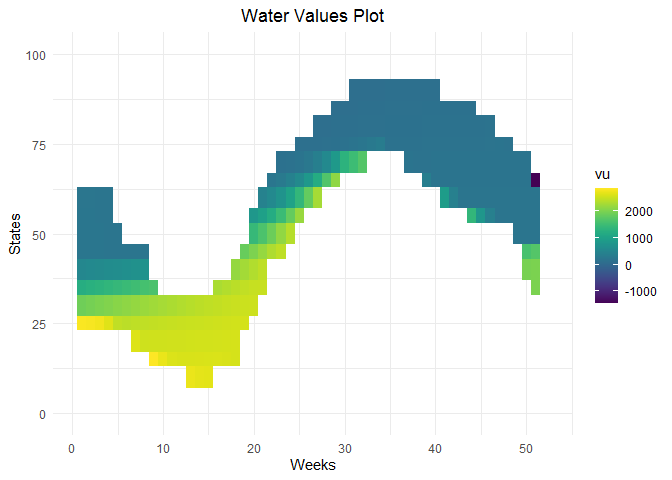
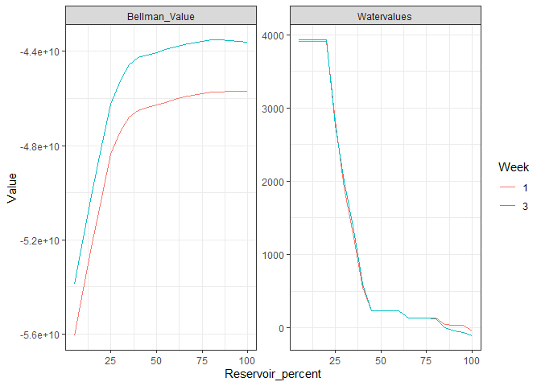
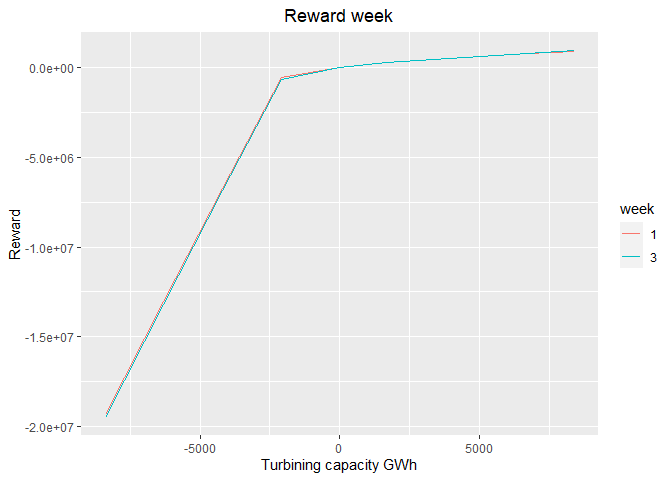
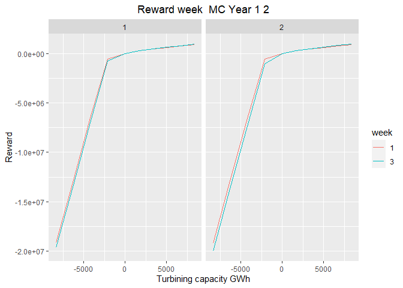
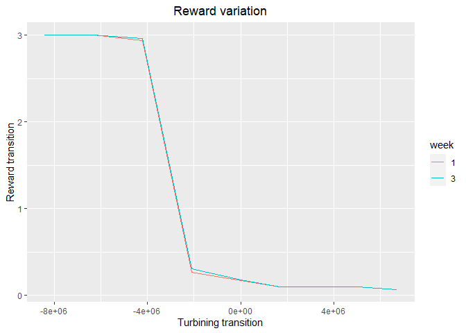
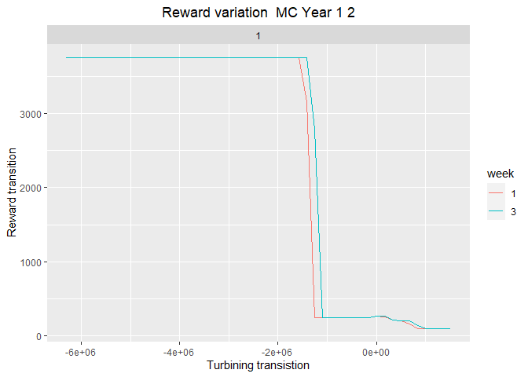

-   [antaresWaterValues](#antareswatervalues)
    -   [Methods Overview](#methods-overview)
    -   [Installation](#installation)
    -   [Getting Started](#getting-started)
    -   [Usage](#usage)
    -   [Plotting Results](#plotting-results)
    -   [Troubleshooting & Help](#troubleshooting--help)

<!-- README.md is generated from README.Rmd. Please edit that file -->


# antaresWaterValues

<!-- badges: start -->
<!-- badges: end -->

antaresWaterValues calculates water values for long-term storages in
Antares studies. The package performs Antares simulations and dynamic
programming approaches.

More theoretical details are available in the vignette:
`vignette("computation_watervalues")`.

## Methods Overview

| Number of stocks | Multistock method     |          Classic reward function <br> (Classic Antares calls)           | Iterative reward function <br> (Classic Antares calls) |       Classic reward function <br> (PLAIA)        | Full PLAIA <br> (reward + Bellman) |
|------------------|-----------------------|:-----------------------------------------------------------------------:|:------------------------------------------------------:|:-------------------------------------------------:|:----------------------------------:|
| Single stock     | –                     | `runWaterValuesSimulation()` +<br> `get_Reward()` +<br> `Grid_Matrix()` |      `calculateBellmanWithIterativeSimulations()`      | `getBellmanValuesSequentialMultiStockWithPlaia()` |   `getBellmanValuesWithPlaia()`    |
| Multiple stocks  | Sequential            |           Not available (would require too many simulations)            | `calculateBellmanWithIterativeSimulationsMultiStock()` | `getBellmanValuesSequentialMultiStockWithPlaia()` |   `getBellmanValuesWithPlaia()`    |
| Multiple stocks  | Simultaneous (Global) |             `getBellmanValuesFromOneSimulationMultistock()`             |                           —                            |                         —                         |                 —                  |

**Legend**

-   **Classic reward function:** The reward function is computed by
    running multiple Antares simulations, each corresponding to a
    different control (i.e., different storage level variations during a
    week, without considering natural inflows). This approach can be
    time-consuming.
-   **Iterative reward function:** Antares simulations are chosen
    iteratively to maximize efficiency. At each step, the controls to be
    evaluated are selected using the current estimation of the reward
    function and Bellman values. After every new simulation, the reward
    function is updated, reducing the total number of runs required.
-   **PLAIA:** The reward function is computed efficiently using PLAIA,
    which keeps the optimization problems in memory and modifies only
    the constraint (right-hand side) corresponding to the control. This
    drastically reduces computation time compared to classic Antares
    calls.
-   **Full PLAIA:** Both the computation of the reward function and the
    Bellman recursion are handled internally by PLAIA, providing maximal
    efficiency.

## Installation

``` r
# Install from GitHub
# install.packages("devtools")
devtools::install_github("rte-antares-rpackage/antaresWaterValues@*release") 
```

## Getting Started

Make sure you have a backup of your Antares study. The package edits and
resets the Antares study, but we recommend saving a copy before your
first use. For troubleshooting, check package dependencies listed in
`DESCRIPTION`.

**Important:** Use the Antares hydro heuristic for all storages when
computing Bellman values.

### Load the package

``` r
library(antaresWaterValues)
```

------------------------------------------------------------------------

## Usage

### 1. With the Shiny app

``` r
opts = antaresRead::setSimulationPath("your/path/to/the/antares/study", "input") 
shiny_water_values(opts)
```

### 2. Scripting without the Shiny app

#### a. Setup your study

``` r
opts <- antaresRead::setSimulationPath("your/path/to/the/antares/study", "input")
```

#### b. Set parameters

``` r
area <- "area"
pumping <- TRUE # TRUE if pumping is possible
mcyears <- 1:3 # Monte Carlo years to use
efficiency <- getPumpEfficiency(area, opts = opts)
name = "3sim"
```

#### c. Run simulations

``` r
simulation_res <- runWaterValuesSimulation(
    area = area,
    nb_disc_stock = 3, # Number of simulations
    mcyears = mcyears,
    path_solver = "your/path/to/antares/bin/antares-8.6-solver.exe",
    opts = opts,
    file_name = name,
    pumping = pumping,
    efficiency = efficiency
)
```

#### d. Retrieve previous simulations

``` r
load(paste0(opts$studyPath, "/user/", tolower(area), "_", name, ".RData"))
```

#### e. Compute reward functions

``` r
reward_db <- get_Reward(
  simulation_names = simulation_res$simulation_names,
  simulation_values = simulation_res$simulation_values,
  opts = opts,
  area = area,
  mcyears = mcyears,
  efficiency = efficiency,
  method_old = TRUE, # TRUE for linear interpolation; FALSE for marginal price
  possible_controls = constraint_generator(
    area = area,
    nb_disc_stock = 20,
    mcyears = mcyears,
    pumping = pumping,
    efficiency = efficiency,
    opts = opts
  )
)
reward <- reward_db$reward
```

#### f. Compute water values

``` r
results <- Grid_Matrix(
  area = area,
  reward_db = reward_db,
  mcyears = mcyears,
  states_step_ratio = 1/20, # State discretization
  opts = opts,
  efficiency = efficiency,
  penalty_low = 1000, # Penalty for bottom rule curve
  penalty_high = 100, # Penalty for top rule curve
  force_final_level = TRUE, # Constraint on final level
  final_level = get_initial_level(area = area, opts = opts), # Target final level (0-100%)
  penalty_final_level_low = 2000,
  penalty_final_level_high = 2000
)
```



``` r
aggregated_results <- results$aggregated_results
```

#### g. Write results to Antares

``` r
reshaped_values <- aggregated_results %>% to_Antares_Format_bis()
antaresEditObject::writeWaterValues(
  area = area,
  data = reshaped_values
)
```

Note: Values in `reshaped_values` may not be monotone because Antares
averages values.

#### h. Make sure `hydro-pricing-mode` is set to `accurate`

``` r
settings_ini <- antaresRead::readIni(file.path("settings", "generaldata.ini"), opts = opts)
settings_ini$`other preferences`$`hydro-pricing-mode` <- "accurate"
antaresEditObject::writeIni(settings_ini, file.path("settings", "generaldata.ini"), overwrite = TRUE, opts = opts)
```

------------------------------------------------------------------------

## Plotting Results

``` r
# Water values visualization
waterValuesViz(Data = aggregated_results, filter_penalties = TRUE)
```



``` r
# Plot Bellman
plot_Bellman(value_nodes_dt = aggregated_results, weeks_to_plot = c(1,3))
```



``` r
# Reward functions
plot_1 <- plot_reward(reward_base = reward, weeks_to_plot = c(1,3))
```



``` r
plot_2 <- plot_reward_mc(reward_base = reward, weeks_to_plot = c(1,3), scenarios_to_plot = c(1,2))
```



``` r
plot_3 <- plot_reward_variation(reward_base = reward, weeks_to_plot = c(1,3))
```



``` r
plot_4 <- plot_reward_variation_mc(reward_base = reward, weeks_to_plot = c(1,3), scenarios_to_plot = c(1,2))
```



------------------------------------------------------------------------

## Troubleshooting & Help

-   For more info, see the package [reference
    documentation](https://rte-antares-rpackage.github.io/antaresWaterValues/).
-   Report bugs or request help by creating an
    [issue](https://github.com/rte-antares-rpackage/antaresWaterValues/issues).
