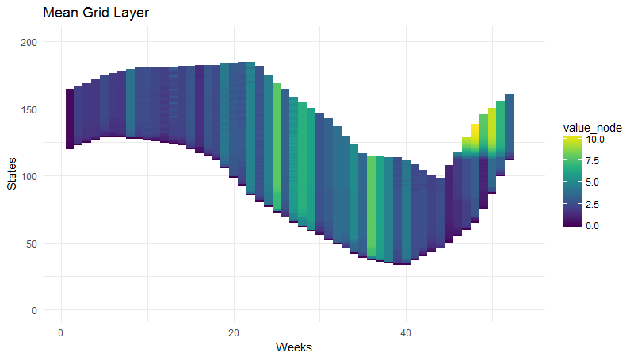

[](https://travis-ci.org/rte-antares-rpackage/antaresWaterValues)

# antaresWaterValues


> Calculate Water Values.


Install the package (you'll also need `antaresEditObject` and `antaresXpansion`):


```r
# From Github
# install.packages("devtools")
devtools::install_github("rte-antares-rpackage/antaresXpansion")
devtools::install_github("rte-antares-rpackage/antaresEditObject")
devtools::install_github("rte-antares-rpackage/antaresWaterValues")

```


## Running water values simulation


```r
library( antaresRead )
library( antaresEditObject )
library( antaresWaterValues )

# Set simulation path to an Antares study in Input mode
setSimulationPath(path = "path/to/simulation/", simulation = "input")

# For speed, we limit the number of MC years to 20
updateGeneralSettings(nbyears = 20)


# Run several simulation with different constraint values

# here 15 simulations with binding constraints values from 0 to 1.344 (max hydro storage on a week)

# This function will run Antares with parameters specified for calculate water values
# (create a fictive area, a link between the area studied and the fictive area,
# a binding constraints, set to 0 the hydro storage times series, ...)
# and return the names of the simulations run

simulation_res <- runWaterValuesSimulation(
  area = "fr",
  nb_simulation = 10,
  path_solver = "C:/antares/bin/antares-6.0-solver.exe", 
  show_output_on_console = FALSE,
  overwrite = TRUE
)
```

When each simulation has run, we can use result to calculate a mean grid layer :


```r
# Parameters

# Values and names for simulations
simulation_names <- simulation_res$simulation_names
simulation_values <- simulation_res$simulation_values

# If you don't have run 'runWaterValuesSimulation' before, you can retrieve names and values like this :
simulation_names <- getSimulationNames(pattern = "decision")
simulation_names <- gsub(pattern = ".*eco-", replacement = "", x = simulation_names)

simulation_values <- gsub("decision|twh", "", simulation_names)
simulation_values <- gsub(",", ".", simulation_values)
simulation_values <- as.numeric(simulation_values)


# Number of weeks
n_weeks <- 52

# states matrix
states <- matrix( rep(seq(from = 10, to = 0, by = -0.05), n_weeks + 1), byrow = FALSE, ncol = n_weeks + 1)


# Nodes values calculation
value_nodes_2017 <- meanGridLayer(
  area = "fr",
  simulation_names = simulation_names, 
  simulation_values = simulation_values,
  states = states, 
  n_runs = 2,
  n_week = n_weeks, 
  week_53 = 0
)
```

Result is a `data.table` with 3 columns, the number of the weeks, the levels of states and the nodes values.

You can tranform this table in a matrix states X weeks like this :

```
library(data.table)
value_nodes_dc <- dcast(
  data = value_nodes, 
  formula = statesid ~ weeks, 
  value.var = "value_node"
)
```

Here's a representation of the result :

```r
library(ggplot2)
library(viridis)
ggplot(data = value_nodes_2017) + 
  aes(x = weeks, y = states, fill = vu) + 
  geom_tile() + 
  scale_fill_viridis(na.value = "transparent") + 
  theme_minimal() + 
  labs(title = "Mean Grid Layer", x = "Weeks", y = "States")

```



Adding bands around water values :

```r
value_nodes_2017 <- value_nodes_2017[, vu_band := addBand(vu = vu, states = states, failure_cost = 100), by = weeks]

ggplot(data = value_nodes_2017) + 
  aes(x = weeks, y = states, fill = vu_band) + 
  geom_tile() + 
  scale_fill_viridis(na.value = "transparent") + 
  theme_minimal() + 
  labs(title = "Mean Grid Layer with bands", x = "Weeks", y = "States")
```


