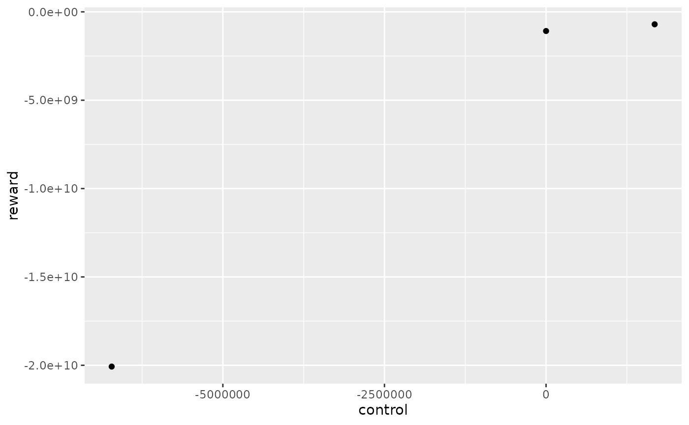
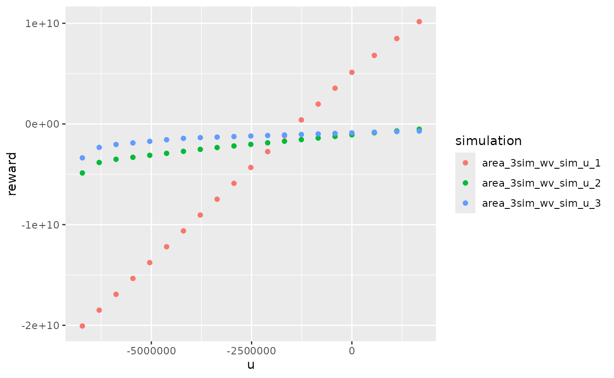
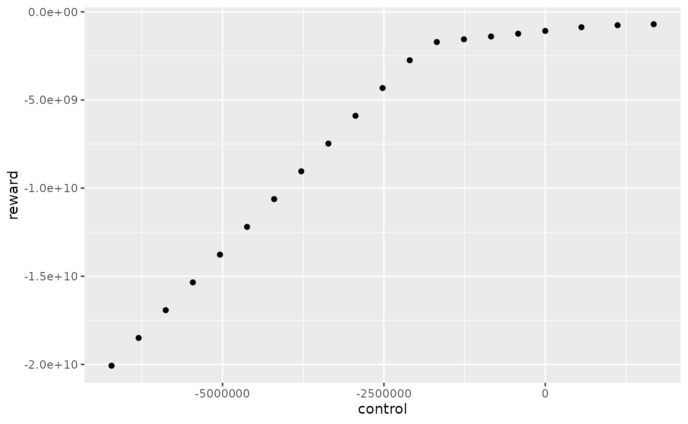

# Reward interpolation method

## Initialize study and run simulations

``` r
library(antaresWaterValues)
library(dplyr)
```

``` r
opts <- antaresRead::setSimulationPath("your/path/to/the/antares/study","input")
```

``` r
area <- "area"
pumping <- T #T if pumping possible
mcyears <- 1:3 # Monte Carlo years you want to use
efficiency <- getPumpEfficiency(area,opts=opts)
name = "3sim"
```

``` r
simulation_res <- runWaterValuesSimulation(
    area=area,
    nb_disc_stock = 3, #number of simulations
    mcyears = mcyears,
    path_solver = "your/path/to/antares/bin/antares-8.6-solver.exe",
    opts = opts,
    otp_dest=paste0(opts$studyPath,"/user"),
    file_name=name, #name of the saving file
    pumping=pumping,
    efficiency=efficiency
  )
```

## Simple interpolation of reward function

With `method_old = T`, the reward function will simply be a linear
interpolation between simulated control and simulation cost with one
control per simulation. This method gives an underestimation of the real
reward function.

``` r
reward_db <- get_Reward(
  simulation_names = simulation_res$simulation_names,
  simulation_values = simulation_res$simulation_values,
  opts=opts,
  area = area,
  mcyears = mcyears,
  efficiency = efficiency,
  method_old = T
)
#> Warning: 'memory.limit()' is Windows-specific
reward_simple <- reward_db$reward
```

In this example, with 3 simulations, the reward function for the first
week and the first Monte Carlo year has 3 different controls.

``` r
reward_simple %>% 
  dplyr::filter(mcYear==1,timeId==1)%>%
  ggplot2::ggplot() +
  ggplot2::aes(x = control, y = reward) +
  ggplot2::geom_point()
```



## Interpolation with marginal prices

With `method_old = F`, each simulation will give one local estimation of
the reward function thanks to marginal prices that is an overestimation
of the real reward function. Local estimations are then combined to form
only one reward function by taking the minimum of all estimations. Each
local estimation is evaluated for controls listed in
`possible_controls`.

``` r
reward_db <- get_Reward(
  simulation_names = simulation_res$simulation_names,
  simulation_values = simulation_res$simulation_values,
  opts=opts,
  area = area,
  mcyears = mcyears,
  efficiency = efficiency,
  method_old = F,
  possible_controls = constraint_generator(area=area,
                                           mcyears=mcyears,
                                           nb_disc_stock = 20,
                                           pumping = pumping,
                                           efficiency = efficiency,
                                           opts=opts)# used for marginal prices interpolation
)
reward_marg_interp <- reward_db$reward
```

We can look at local estimation of reward function :

``` r
reward_db$local_reward %>% 
  dplyr::filter(mcYear==1,week==1) %>%
  ggplot2::ggplot() +
  ggplot2::aes(x = u, y = reward, color = simulation) +
  ggplot2::geom_point()
```



The final estimation is obtained by taking the minimum of all
estimations :

``` r
reward_marg_interp %>% 
  dplyr::filter(mcYear==1,timeId==1) %>%
  ggplot2::ggplot() +
  ggplot2::aes(x = control, y = reward) +
  ggplot2::geom_point()
```



In this example, with `nb_disc_stock = 20`, the reward function for the
first week and the first Monte Carlo year has 20 different controls.

## Comparaison

``` r
rbind(dplyr::mutate(reward_marg_interp,interpolation = "marg_prices"),
      dplyr::mutate(reward_simple,interpolation = "simple")) %>%
  dplyr::filter(mcYear==1,timeId==1) %>%
  ggplot2::ggplot() +
  ggplot2::aes(x = control, y = reward, color = interpolation) +
  ggplot2::geom_line(linewidth = 1) +
  ggplot2::geom_point()
```


Simple interpolation undestimates the reward function and interpolation
with marginal prices overestimates the reward function. The real one is
between the red and the blue curve. The interpolation with marginal
prices is more time consuming but is more precise for the same number of
simulation so this method should be use in order to reduce the number of
simulations.
