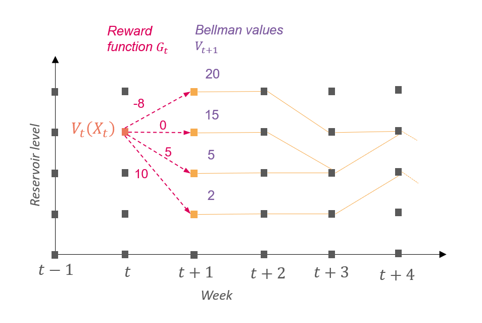

# Watervalues computation

## Theory

### Why do we need water values ?

Antares solves the annual unit commitment problem week by week. When
long term hydraulic storages are used in Antares, a procedure is needed
to determine which amount of water Antares should use for a given week
and which amount Antares should keep for the rest of the year. One
method to do so is to use water values.

### What are water values ?

Water values are prices in euros per MWh that helps Antares, in his
weekly sequentially resolution, to determine whether to use the water
stocked in reservoirs during the current week or to keep it for later in
the year. There is one water value per area, per week and per reservoir
level. Water value reprensents the best price at which the slice of
storage could sold between the given week and the end of the year. Water
values are comparable to marginal prices of thermal units. A simple
criterion to understand water values is the following :

- During an hour, if the marginal price is greater than the water value,
  it’s better to turbine the water in the reservoir.

- Otherwise, if the marginal price is lower than the water value
  multiplied by the pumping efficiency, it’s better to pump water into
  the reservoir, if pumping is possible.

These water values are defined by the user so they need a method to
compute them.

### How to compute water values ?

Water values are the derivatives of Bellman values. Bellman values are
given, alike water values, for each area, each week and each reservoir
level. They represent the future avoided cost in euros when considering
the amount of water stored in the reservoir. They are supposed to be
concave with respect to the reservoir level for a given week. In
consequence, water values are supposed to be decreasing with respect to
the reservoir level for a given week and this is one strong assumption
of Antares.

### How to compute Bellman values ?

To compute Bellman values, dynamic programming is used by solving the
following optimization problems for each week and each reservoir level.
This means that one begins by solving the problem of the last week of
the year and then one solves the precedent week through backtracking.

$$V_{t}\left( X_{t} \right) = \max\limits_{U \in {\lbrack U^{min},U^{max}\rbrack},X_{t + 1} = X_{t} - U_{t} + I_{t},X_{t + 1} \in {\lbrack X_{t + 1}^{min},X_{t + 1}^{max}\rbrack}}G_{t}\left( X_{t},U_{t},W_{t} \right) + V_{t + 1}\left( X_{t + 1} \right)$$

We use the following notations :

- $t \in \lbrack 1,T\rbrack$ representing the weeks of the year.

- $V_{t}\left( X_{t} \right)$ is the Bellman value for week $t$ and for
  the reservoir level at the beginning of week $t$$X_{t}$.

- $V_{T + 1}\left( X_{T + 1} \right) = K\left( X_{T + 1} \right)$ is the
  Bellman value at the end of the year that is supposed to be known.

- $U_{t}$ is the amount of water generated ($> 0$) or pumped ($< 0$)
  with extreme values $U^{min}$ and $U^{max}$. It is also called the
  control.

- $I_{t}$ is the inflow during week $t$.

- $\left\lbrack X_{t}^{min},X_{t}^{max} \right\rbrack$ are the rule
  curves for the beginning of week $t$.

- $G_{t}\left( X_{t},U_{t},W_{t} \right)$ is the reward during week $t$
  depending on the hazards $W_{t}$ that comprise the inflow. Hazards are
  represented by Monte Carlo years in Antares.

This equation means that the reward that is possible to earn between the
beginning of week $t$ and the end of the year is the best compromise
between the reward at week $t$ and the reward between the beginning of
week $t + 1$ and the end of the year. In other words, it is the best
compromise between using water during week $t$ and keeping it for the
other weeks.

### How water values are used in Antares ?

Once water values have been computed by differentiating Bellman values,
the user should send them to Antares. Antares will use them differently
depending on the `hydro-princing-mode` :

- `fast` : generating and pumping will be penalized for the given week
  at the water value of the beginning of the week for the initial level
  of the week similar to the explanation in [What are water values
  ?](#what-are-water-values). This mode assumes the level of storage is
  not going to change during the week.

- `accurate` (recommended) : Bellman values are built from water values
  and the objective function of Antares will be to minimize operational
  cost for the week minus Bellman value for the final level of stock
  (that represent the avoided future costs).

## Practice : how water values are computed in this package ?

There are three main steps to compute water values in this package using
Antares :

1.  Compute rewards functions $G_{t}\left( X_{t},U_{t},W_{t} \right)$
    for all weeks and all possible hazards.

2.  Apply the precedent equation to compute Bellman values.

3.  Compute the derivative of Bellman values to get water values.

Each step is detailed is the following paragraphs.

### Rewards functions

First of all, we assume that the reward
$G_{t}\left( X_{t},U_{t},W_{t} \right)$ doesn’t depend on the reservoir
level $X_{t}$ so it becomes $G_{t}\left( U_{t},W_{t} \right)$ which
means the reward depends only on the week, the scenario and the control
of the storage.

Reward functions are computed in two steps : the first one is to launch
Antares simulation (“simulation tab” in the shiny interface or
[`runWaterValuesSimulation()`](https://rte-antares-rpackage.github.io/antaresWaterValues/reference/runWaterValuesSimulation.md)
) and the second one is to use the simulation results to build the
reward function (“calculate water values” tab or
[`get_Reward()`](https://rte-antares-rpackage.github.io/antaresWaterValues/reference/get_Reward.md)).

For the first step, the user chooses a number of controls
(`nb_disc_stock`) for which the reward $G_{t}$ function will be
evaluated. There is the same number of controls for each week and each
scenario but the value of the controls can change if the maximum power
of the turbine varies between weeks. For each control, a complete
Antares simulation is launched, IE for all weeks and all Monte Carlo
years. This means there is exactly one Antares simulation per control.
To evaluate the reward associated with a control, the control of the
storage is forced over the week by deactivating the storage and creating
two fictive nodes representing respectively generating and pumping and a
binding constraint linking the two nodes to simulate the behavior of the
storage. The reward is then the opposite of the weekly operational cost.

Once all simulations are run, in the second step, simulation results are
used to build reward functions. See
[`vignette("Reward-interpolation")`](https://rte-antares-rpackage.github.io/antaresWaterValues/articles/Reward-interpolation.md)
for more details.

### Computation of Bellman values

Using reward functions, one can now calculate Bellman values with
[`Grid_Matrix()`](https://rte-antares-rpackage.github.io/antaresWaterValues/reference/Grid_Matrix.md).
This function computes Bellman values for each week and each scenario
using the previous reward function and the formula given in [How to
compute Bellman values ?](#how-to-compute-bellman-values). More details
on this function are given in
[`vignette("grid_Matrix-parameters")`](https://rte-antares-rpackage.github.io/antaresWaterValues/articles/grid_Matrix-parameters.md)

### Computation of water values

This last step is very simple. The package interpolates Bellman values
to have values every 1% of storage and then calculates the derivative of
Bellman values to have one value per reservoir level and per day (water
values are constant for a given week). This is done in function
[`to_Antares_Format()`](https://rte-antares-rpackage.github.io/antaresWaterValues/reference/to_Antares_Format.md).
Water values can be written to Antares with
[`antaresEditObject::writeWaterValues`](https://rte-antares-rpackage.github.io/antaresEditObject/reference/writeWaterValues.html).
