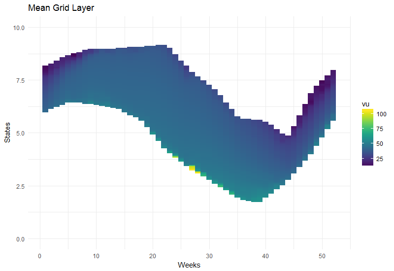
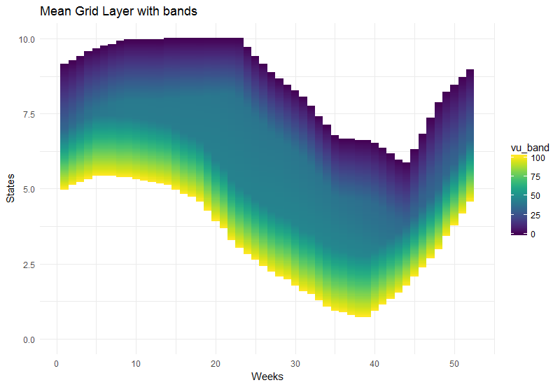

```{r, include = FALSE}
knitr::opts_chunk$set(
  collapse = TRUE,
  comment = "#>"
)
```


The `antaresWaterValues` package aims at generating and exporting water values for
Antares v7. In this vignette, we detail how to use it step by step.


## Setup

First we have to load `antaresWaterValues` and two helper packages. We also setup
the path to the Antares study:

```{r eval=FALSE}
library(antaresWaterValues)
library(antaresRead)
library(antaresEditObject)

# simulation path
antaresRead::setSimulationPath(path = "inputs/my_study/", simulation = "input")
```


## Simulations

Next, it's necessary to run a number of simulations in Antares. These simulations
are launched from R with the `runWaterValuesSimulation()` function and are run by
the Antares solver.

```{r eval=FALSE}
simulation_res <- runWaterValuesSimulation(
  area = "fr",
  nb_mcyears = 20,
  path_solver = "D:/Program Files/RTE/Antares/7.0.0/bin/antares-7.0-solver.exe",
  nb_disc_stock = 10,
  overwrite = TRUE
)
```

 * `area` is the relevant area.
 * `nb_mcyears` is the number of Monte-carlo year that will be generated. Here we
 limit it to 10 to increase speed.
 * `path_solver` is the path to the Antares solver.
 * `nb_disc_stock` is the number of values used to discretize the stock level between
 0 and the maximum value for the given area. Here 10 simulations are run, with 10
 binding constraints ranging from 0 to 1.344 TWh, which is the maximum of hydro
 energy that can be produced in France over a week.
 * `overwrite` allows to overwrite the area, cluster and binding constraint if they
 already exist.


## Water values

Water values are generated in R with the `meanGridLayer()` function, using the results
of the above simulations.

```{r eval=FALSE}
value_nodes_2017 <- meanGridLayer(
  area = "fr",
  simulation_names = simulation_res$simulation_names, 
  simulation_values = simulation_res$simulation_values,
  week_53 = 0,
  nb_cycle = 2
)
```

 * `area` is the relevant area.
 * `simulation_names` are the names of the simulations (see the note below).
 * `simulation_values` are their values.
 * `week_53` are the water values for the last week of the year.
 * `nb_cycle` is the number of times to run the algorithm in a loop from the last
 week of the year to the first, in order to obtain more realistic start values for 
 week 53.

Note: If simulations have not been run just before, their names and values can be
retrieved this way:

```{r eval=FALSE}
simulation_names <- getSimulationNames(pattern = "decision")
simulation_names <- gsub(pattern = ".*eco-", replacement = "", x = simulation_names)

simulation_values <- gsub("decision|twh", "", simulation_names)
simulation_values <- gsub(",", ".", simulation_values)
simulation_values <- as.numeric(simulation_values)
```


## Plotting results

Results can be visualised with `waterValueViz()`:

```{r eval=FALSE}
waterValuesViz(value_nodes_2017)
```


It's also possible to add bands around the values:

```{r eval=FALSE}
waterValuesViz(value_nodes_2017, add_band = TRUE, bandwidth = 100, failure_cost = 100)
```




## Exporting results


